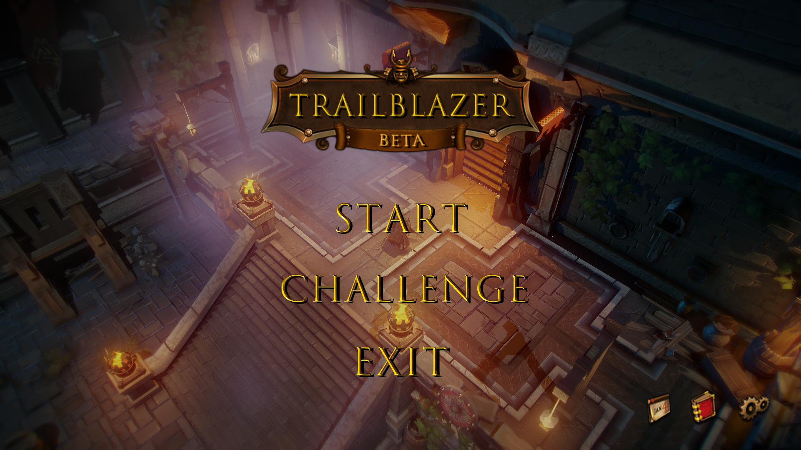
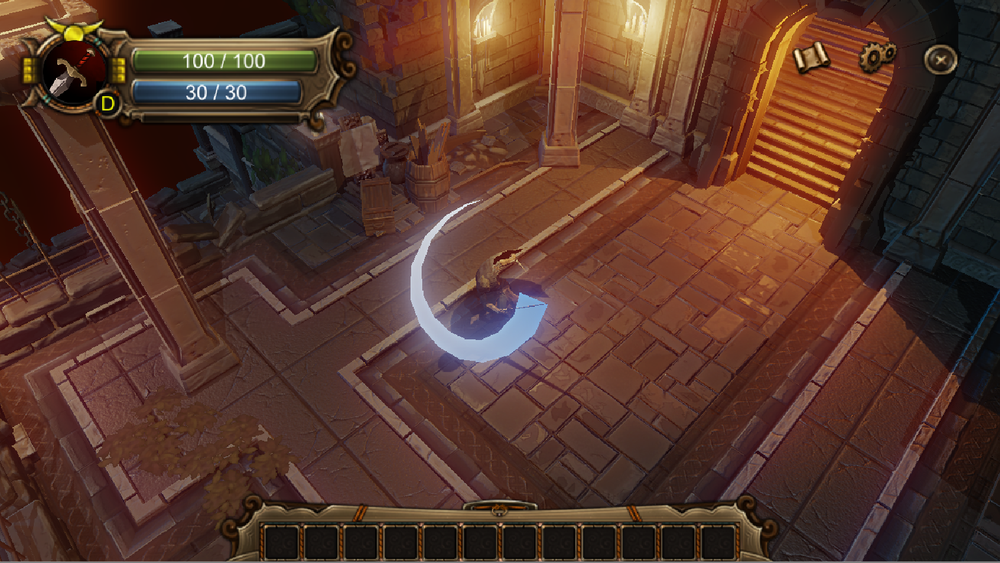
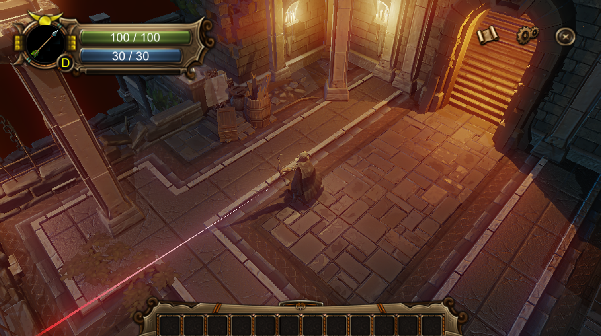
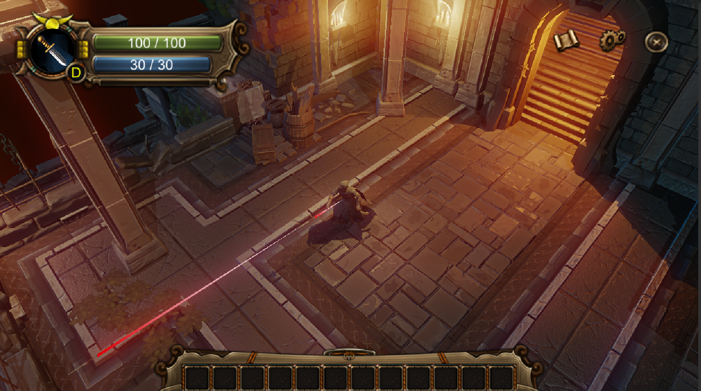
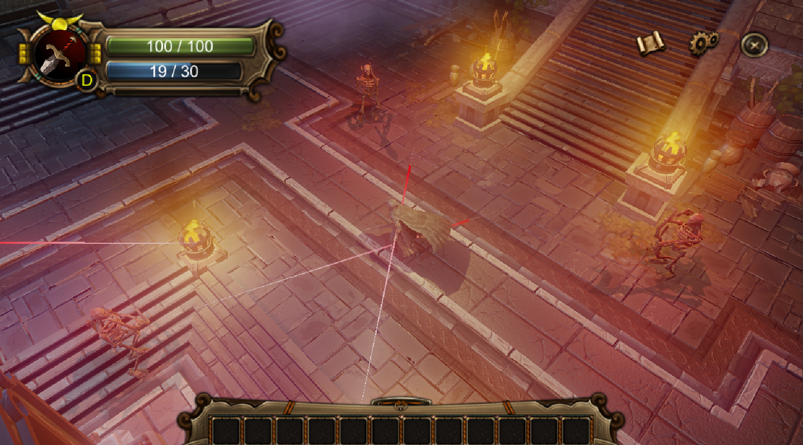
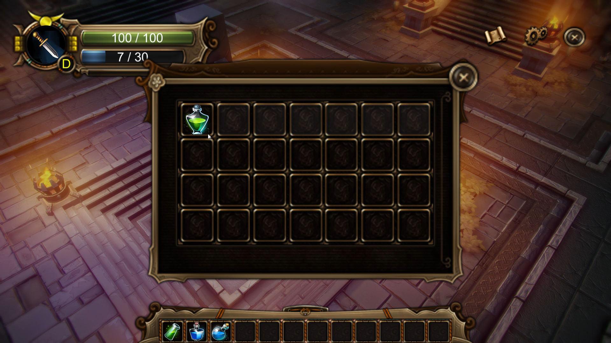
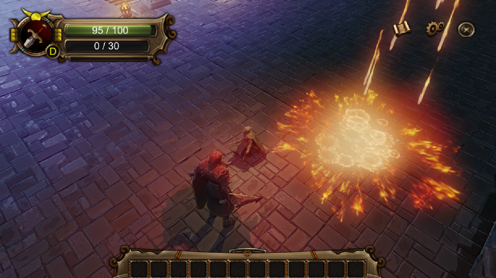
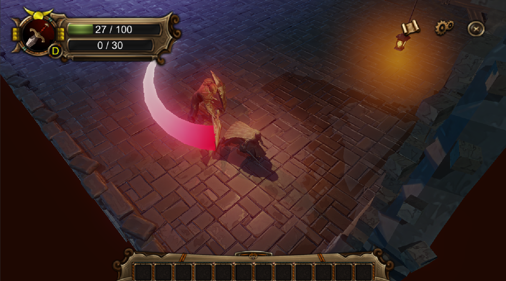

# trailblazer

一款参赛作品，3D的ARPG游戏 
主角作为一名盗贼，前往阴暗的地牢，在未知的世界中与怪物战斗，探索地牢遗迹中隐藏的秘密 
每个不同的区域之间用通道连接，一片区域中有数个敌人，清理一片区域后有概率掉落各种物品，玩家也可以选择不清理直接到达下个区域 
人物可以选择3种攻击模式，剑，弓箭，匕首。可以随时切换 
剑只能近战，弓只能远程，匕首两者皆可不过攻击力会大打折扣 
关于评级，评级时刻在自动下降，只有在人物击中敌人时，会提升评级，故只有不断地打击敌人才能提升评级，共有DCBAS五个等级。 
游戏由unity实现，针对移动端和PC采用不同的交互适配。移动端的样品位于apk/trailblazer.apk，美术资源全部来源于网络 
 
A 3D ARPG Game about sword and magic, built by Unity. 
The character can use a sword, a bow and arrows, and a dagger. 
There are 5 battle ranks, including D, C, B, A and S. 
The battle rank can be improved by attacking enemies, if you stop attacking, it will also decline.  
This game can be deployed on Android and Windows system, apk for Android is in apk/trailblazer.apk  
 
 

